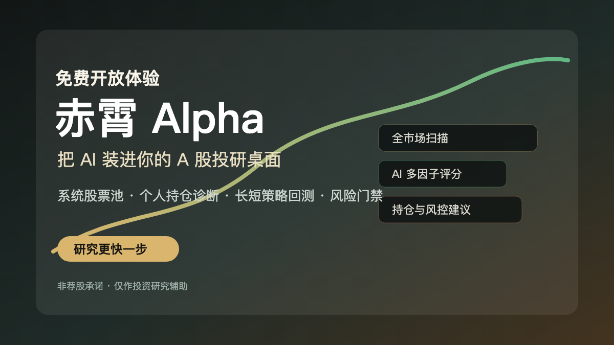
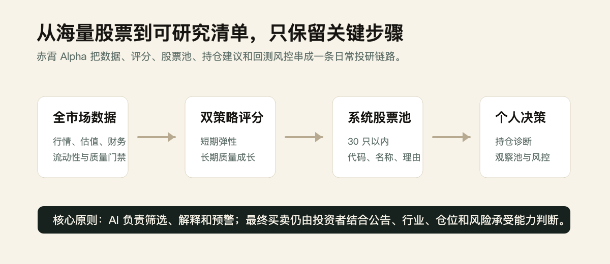
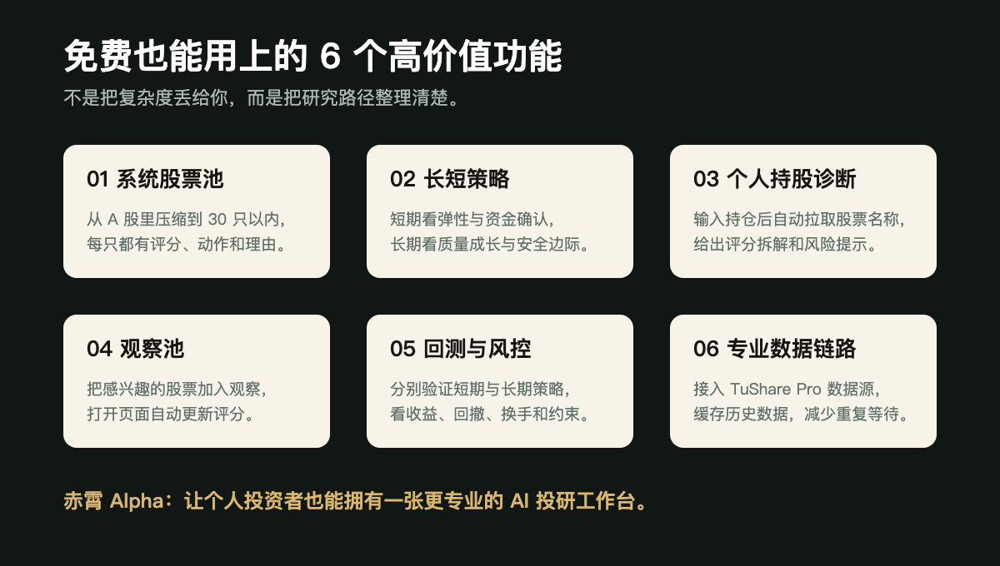

# 赤霄 Alpha 最新升级：从“帮你选股”，进化到“帮你做计划和复盘”

上一篇文章里，我已经介绍过赤霄 Alpha 的基础能力：

- 系统股票池；
- 短期/长期选股；
- 个人持仓分析；
- 观察池；
- 回测与风控。

如果只停留在这些功能，它已经可以帮个人投资者提高筛选效率。

但我后来越想越觉得：**只会筛股票还不够。**

因为真实投资里，最难的往往不是“看到一个机会”，而是后面的三件事：

1. 这个机会现在该不该动手？
2. 如果动手，买多少、卖多少、怎么分批？
3. 做完之后，怎么复盘自己到底做对了还是做错了？

所以这次升级，我重点做了几个更接近真实投资流程的功能。

这篇文章不重复介绍基础功能，只讲最新版新增和优化的部分。

---

## 这次升级的核心：让模型建议更接近“可执行计划”

很多投资工具的问题是：它能给你一个评分，甚至给你一个股票池。

但你真正要下判断时，还是会卡住：

> 评分高就一定买吗？  
> 我手里已经有仓位，还要不要加？  
> 系统推荐的新股票，是否比我现在持有的更值得占用资金？  
> 买入以后如果走弱，什么条件下应该退出？  
> 没买的股票，后面涨了，到底是错过机会，还是本来就不该买？

这些问题，才是个人投资者每天真正面对的。

所以最新版赤霄 Alpha 的重点，不是再堆更多指标，而是把指标变成更清楚的 **交易计划、影子跟踪和复盘闭环**。

---

## 新功能一：最优交易计划引擎

这次最重要的升级，是个人持股页面新增了 **最优交易计划**。

你只需要输入：

- 账户总资产；
- 可用资金；
- 最小交易金额。

系统会把你的当前持仓、系统短期股票池、长期股票池、个股评分、风险预算和可用资金放在一起，生成一份手动下单参考计划。

它不是简单说“买入”或“卖出”，而是尽量回答更具体的问题：

| 问题 | 系统现在会怎么处理 |
| --- | --- |
| 哪些持仓要处理？ | 根据评分、风险门禁、仓位偏离和替代机会排序 |
| 哪些股票值得继续跟踪？ | 放入影子组合或观察状态 |
| 买入多少？ | 按账户资金、目标仓位和一手股数估算 |
| 卖出多少？ | 按当前仓位和目标风险预算估算 |
| 是否现在就买？ | 结合入场评分、赔率和资金优先级判断 |
| 后面怎么加仓？ | 设置首笔仓位、加仓条件和失效条件 |

这对个人投资者很重要。

因为很多人不是没有观点，而是缺少一套把观点落到仓位和动作上的流程。

最新版赤霄 Alpha 想做的是：  
**把“看起来不错”变成“是否值得占用资金”。**

---

## 新功能二：买点、赔率和仓位分层

以前很多评分系统只告诉你：这只股票多少分。

但实盘里，高分不等于现在就可以买。

一只股票可能评分很高，但已经涨太急、换手太热、盘口不好、接近涨停，短期追进去反而风险很大。

所以这次交易计划里新增了几个更接近实盘的问题：

### 1. 入场时机

系统会给出类似：

- 可执行买点；
- 等待确认；
- 低吸观察；
- 暂不入场。

它不是只看分数，而是结合趋势、成交、收盘位置、波动和风险标记。

### 2. 赔率判断

系统会估算一个大致的上行/下行关系。

如果一只股票看起来有机会，但潜在回撤太大，赔率不足，系统会降低它的执行优先级。

### 3. 仓位分层

系统不会默认“一把满仓”。

它会拆成：

- 首笔仓位；
- 后续加仓；
- 单票上限；
- 防守纪律。

核心思想是：

> 盈利后再考虑加仓，亏损不默认补仓。  
> 买之前先知道错了怎么办。

---

## 新功能三：影子组合

这次升级里，我很喜欢的一个功能是 **影子组合**。

它解决的是一个很真实的问题：

很多股票你当时没有买，但它值得记录。

过去我们经常会这样：

今天看到一个候选，觉得还可以，但没买。

过几天它涨了，心里想：早知道就买了。

但这种“早知道”其实没有意义。

更专业的做法是把它记录下来：

- 当时为什么没买？
- 当时评分多少？
- 当时入场条件是否满足？
- 后面 5/10/20 个交易日表现如何？
- 它有没有跑赢我的真实持仓？

影子组合就是为这个设计的。

它不是让你多买股票，而是让你更清楚地观察：

- 哪些机会是真机会；
- 哪些只是模型噪音；
- 哪些股票值得下次优先关注；
- 哪些错过其实并不可惜。

---

## 新功能四：复盘学习

我一直觉得，个人投资者真正应该建立的是“决策数据库”。

不是每天看很多观点，而是知道自己过去的判断到底怎么样。

这次最优交易计划里，每条计划都可以标记：

- 采纳；
- 观察；
- 跳过。

系统会把这些记录保存下来，后续用于统计和复盘。

这件事短期看不刺激，但长期非常重要。

因为一个投资者真正需要知道的是：

- 我采纳的计划，后面表现怎么样？
- 我跳过的机会，是不是经常错过好股票？
- 我观察的股票，有没有成为更好的买点？
- 我是不是经常在赔率不足时冲动买入？
- 我是不是对亏损股票过度死扛？

当这些问题有了记录，投资才开始从“感觉”变成“可复盘的过程”。

---

## 新功能五：个人持股建议更贴近散户资金管理

这次也调整了个人持股里的仓位逻辑。

之前系统有些建议过于机构化，容易出现仓位太分散的问题。

但个人投资者资金量通常没那么大，如果每只股票只建议 2%、3%，实际很难管理，也不符合多数散户资金管理习惯。

所以现在的思路更贴近个人账户：

- 真正优质的核心股票，可以给更高仓位上限；
- 普通机会不鼓励过度分散；
- 风险较高或不活跃股票，会降低仓位建议；
- 明显不看好的股票，不会只让你“死拿”，会提示策略性清仓或退出；
- 每只股票的仓位建议会结合规模、股性、活跃度和风险特征。

这比简单给一个固定仓位更合理。

因为不同股票的股性不同。

小盘高弹性、核心龙头、低波动质量股、题材过热股，不能用同一套仓位语言。

---

## 新优化：顶部说明不再误导

这次还做了一个很小但很重要的修正。

之前每个页面顶部都会显示类似：

> 当前市场状态、回测阈值、目标仓位、单票上限、现金底仓。

但后来我发现，这个描述放在所有页面并不准确。

比如“反馈与投诉”“数据管理”“Admin后台”，和回测阈值没有关系。

所以最新版做了拆分：

- 系统股票池页：显示短/长入池数量、最新交易日、短/长阈值；
- 个人持股页：说明建议来自个人持仓、短期/长期评分和风险预算；
- 回测与风控页：才显示回测场景、入选阈值、目标股票暴露、单票上限、现金底仓；
- 数据、反馈、Admin 等页面：不再显示回测参数。

这个改动看起来像文案，但本质是 **信息口径治理**。

投资工具最怕“看起来很专业，但实际口径混乱”。

所以我宁愿把话说清楚一点，也不要让用户误解。

---

## 新功能六：反馈与投诉通道

产品继续迭代，必须听真实用户怎么用。

所以这次加了一个简单的 **反馈与投诉** 页面。

用户可以提交：

- 产品建议；
- 投诉；
- 系统问题；
- 数据问题；
- 其他反馈。

提交后会自动生成反馈编号。

管理员后台可以看到反馈队列，修改处理状态，填写处理备注。

这个功能不会让系统看起来更“炫”，但它会让产品更可靠。

因为真正有用的投研系统，不可能只靠开发者闭门造车。

---

## 这次升级后，我建议你这样用

如果你已经体验过第一版，可以不用重新从基础功能开始看。

建议直接按下面这个流程：

1. 进入“系统股票池”，更新短期和长期股票池；
2. 看短期池里有没有新的高弹性机会；
3. 看长期池里有没有值得持续研究的公司；
4. 到“个人持股”确认自己的持仓评分；
5. 输入总资产和可用资金，生成最优交易计划；
6. 对计划里的股票标记“采纳 / 观察 / 跳过”；
7. 把暂时不买但值得跟踪的股票放进影子组合；
8. 几天后回来看复盘结果。

这套流程的重点不是“马上交易”，而是让每一次判断都有出处、有计划、有后续记录。

---

## 这次升级真正想解决什么？

如果用一句话总结：

> 第一版解决“看什么股票”。  
> 这一版开始解决“怎么做计划，以及怎么复盘”。

这也是我认为个人投资者最需要提升的地方。

不是再多看几个指标，也不是每天追更多消息。

而是让投资过程更系统：

- 候选从哪里来；
- 为什么入选；
- 是否值得买；
- 买多少；
- 什么条件下加仓；
- 什么条件下退出；
- 没买的股票如何跟踪；
- 决策后如何复盘。

当这些问题都能被记录下来，投资就不再只是情绪反应。

---

## 体验方式

赤霄 Alpha 目前仍然免费开放体验。

如果你已经拿到入口，可以直接登录使用最新版。

如果还没有入口，可以通过公众号后台回复：

> **赤霄**

获取最新体验地址和使用说明。

---

## 最后

我不想把赤霄 Alpha 做成一个只会喊“买入”的工具。

那样很容易吸引眼球，但对真正做投资的人帮助有限。

我更希望它变成一个个人投资者可以长期使用的 AI 投研桌面：

- 帮你筛掉大部分噪音；
- 帮你发现值得研究的股票；
- 帮你处理自己的持仓；
- 帮你生成更清楚的交易计划；
- 帮你记录那些没买、买了、跳过的决策；
- 最后帮你复盘，看看自己到底有没有进步。

市场永远有不确定性。

工具不能替你承担风险。

但一个好的工具，至少应该帮你少一点混乱，多一点纪律。

这就是这次升级想做的事。

---

风险提示：本文仅介绍产品功能，不构成任何投资建议或收益承诺。证券市场有风险，任何交易决策都需要结合个人风险承受能力、公告信息、交易规则和独立判断。
